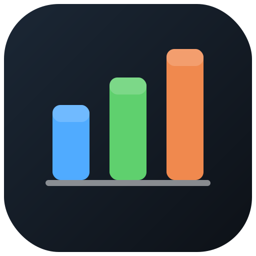

<h1>
  
  &nbsp;Azure Capacity &amp; Enablement Toolkit
</h1>

[](https://github.com/microsoft/capacity-toolkit/actions/workflows/ci.yml)
[](https://microsoft.github.io/capacity-toolkit/)
[](LICENSE)
[](docs/getting-started.md)
[](docs/quota-groups.md)

> 📖 **Documentation site:** **<https://microsoft.github.io/capacity-toolkit/>** — the same guides
> that live in [`docs/`](docs/), with search and navigation.

> **Read-only by default** — analysis tools and a self-contained dashboard for Azure regional
> capacity, availability-zone enablement, and quota, runnable with Reader access (only Spot
> placement needs one extra read-only role); plus one
> **opt-in** tool to provision quota groups.

A **read-only-by-default** toolkit that shows you, in concrete numbers, what is actually enabled in
an Azure region: which VM SKUs are available regionally and per availability zone, how much quota and
headroom you have, how each subscription maps to the physical zones, and what your AKS and database
footprint looks like. The analysis side needs nothing more than **Reader** access; a single
**opt-in** write tool can provision quota groups when you choose to (see
[Services & coverage](#services--coverage)).

It covers the questions that come up in a regional-capacity review — constrained VM SKUs,
regional-vs-zonal enablement gaps, per-subscription zone mapping, quota sizing across quota groups,
and AKS resilience — packaged as generic scripts plus a single, self-contained HTML dashboard.

## What it answers

- *Is SKU X enabled regionally? In which availability zones?*
- *Which of my subscriptions are missing enablement?*
- *How much quota / headroom do I have per VM family, and where is it stranded?*
- *How do logical zones (1/2/3) map to physical zones for each subscription?*
- *How many AKS clusters do we have, where, and on what node SKUs?*
- *Which regions do we run in, and is region X a viable alternative to deploy/move to?*
- *Do we have quota groups, how are they designed, and is there pooled headroom?*
- *Am I about to hit a non-compute limit — public IPs, NICs, load balancers, storage accounts, App Service plans, SQL/Cosmos throughput, resource groups, role assignments?*
- *Do we hold guaranteed (reserved) capacity, and is it actually being used?*
- *Is there actually Spot capacity to place SKU X in region/zone Y right now (placement score)?*
- *Draft me the support request to enable SKU X regionally and in AZ01/AZ02/AZ03.*

## Services & coverage

What the toolkit looks at, and along which dimensions. Everything here is **read-only
analysis** (Reader is enough for all of it except Spot placement — see footnote ⁴) — see the note below for the one optional write tool.

| Service / area | SKU & region | AZ enablement | Quota & headroom | Resilience / HA | Inventory | Key scripts |
|---|:---:|:---:|:---:|:---:|:---:|---|
| **Compute — VMs & VM Scale Sets** | ✅ | ✅ | ✅ | ✅ | ✅ | `Get-UsedSkus`, `Scan-SkuEnablement`, `Get-SkuCatalogue`, `Get-QuotaUsage`, `Get-ZoneMappings` |
| **Spot placement (allocation likelihood)** | ✅ | ✅ | ✅⁴ | — | — | `Get-SpotPlacementScore` |
| **Capacity reservations (guaranteed capacity)** | ✅ | ✅ | — | ✅ | ✅ | `Get-CapacityReservations` |
| **AKS (managed Kubernetes)** | ✅ | ✅ | ✅¹ | ✅ | ✅ | `Get-AksInventory`, `Get-AksScaleHeadroom` |
| **Networking (VNets, public IPs, NICs, LBs, NAT gateways)** | — | — | ✅ | — | ✅ | `Get-NetworkQuota` |
| **App Service (Microsoft.Web plans)** | — | — | ✅ | — | ✅ | `Get-AppServiceQuota` |
| **Storage (account count + disk inventory)** | — | — | ✅ | — | ✅ | `Get-StorageQuota` |
| **Data PaaS — Azure SQL + Cosmos DB** | — | — | ✅² | — | ✅ | `Get-PaasQuota` |
| **PostgreSQL / MySQL Flexible Servers** | ✅ | ✅ | — | ✅ | ✅ | `Get-FlexServerZones` |
| **Subscription / RG structural limits** | — | — | ✅³ | — | ✅ | `Get-SubscriptionLimits` |
| **Quota Groups (pooled vCPU quota)** | — | — | ✅ | — | ✅ | `Get-QuotaGroups`, `Get-QuotaGroupPlan` |
| **Any zone-pinned resource / region footprint** | — | ✅ | — | ✅ | ✅ | `Get-ZonalResourceInventory`, `Get-ResourceInventory`, `Get-RegionFootprint` |

¹ AKS node pools draw on the same VM-family quota as compute, so quota coverage is via the compute families.
² Azure SQL exposes true subscription/region + per-server quota; Cosmos DB has no subscription/region RU/s quota API, so Cosmos coverage is throughput **inventory** (clearly flagged informational).
³ Subscription / resource-group structural limits (resource groups, tags, resources per type, deployments, role assignments) are **documented ARM constants**, not adjustable capacity quotas — counted live and compared against the cited limits.
⁴ Spot placement scores are an **allocation-likelihood signal**, not a quota. This is the one analysis tool that needs more than Reader: the read-only **Compute Recommendations Role** (`placementScores/generate/action` — no mutations).

📚 **Learn more (official Microsoft docs):**
[availability zones](https://learn.microsoft.com/en-us/azure/reliability/availability-zones-overview) ·
[regions](https://learn.microsoft.com/en-us/azure/reliability/regions-overview) ·
[VM vCPU quotas](https://learn.microsoft.com/en-us/azure/virtual-machines/quotas) ·
[Quota Groups](https://learn.microsoft.com/en-us/azure/quotas/quota-groups) ·
[capacity reservations](https://learn.microsoft.com/en-us/azure/virtual-machines/capacity-reservation-overview) ·
[networking limits](https://learn.microsoft.com/en-us/azure/azure-resource-manager/management/azure-subscription-service-limits#networking-limits) ·
[App Service limits](https://learn.microsoft.com/en-us/azure/azure-resource-manager/management/azure-subscription-service-limits#app-service-limits) ·
[Storage account limits](https://learn.microsoft.com/en-us/azure/storage/common/scalability-targets-standard-account) ·
[Azure SQL limits](https://learn.microsoft.com/en-us/azure/azure-sql/database/resource-limits-logical-server) ·
[Cosmos DB limits](https://learn.microsoft.com/en-us/azure/cosmos-db/concepts-limits) ·
[subscription &amp; RG limits](https://learn.microsoft.com/en-us/azure/azure-resource-manager/management/azure-subscription-service-limits) ·
[AKS reliability](https://learn.microsoft.com/en-us/azure/reliability/reliability-aks) ·
[PostgreSQL](https://learn.microsoft.com/en-us/azure/reliability/reliability-database-postgresql) /
[MySQL](https://learn.microsoft.com/en-us/azure/reliability/reliability-database-mysql) reliability.
More in [Concepts → Further reading](docs/concepts.md#further-reading--official-microsoft-documentation).

> 🛠️ **One optional write tool.** Beyond analysis, `Deploy-QuotaGroups.ps1` (with the
> `New-QuotaGroupConfig.ps1` bridge) can *provision* quota groups from a JSON design. It is
> a deliberately separate, **opt-in** tool: PowerShell 7+, supports `-WhatIf`, is guarded by
> `ShouldProcess`, and needs elevated quota roles. The rest of the toolkit stays Reader-only.
> See **[Quota Groups rollout](docs/quota-groups.md)**.

## 60-second quick start

```powershell
# 1. Sign in to the target tenant
az login --tenant <TENANT_ID>

# 2. Discover what's actually in use → capacity-config.json
.\scripts\Get-UsedSkus.ps1 -Location norwayeast

# 3. Run the combined report + dashboard
.\scripts\New-CapacityReport.ps1 -ConfigPath .\output\capacity-config.json `
    -SecondaryRegion swedencentral `
    -IncludeAks -IncludeZonal -IncludeCatalogue -IncludeInventory -IncludeQuotaGroups `
    -Dashboard -EnablementRequest

# 4. Open output\capacity-dashboard-<date>.html
```

Full walkthrough: **[Getting started](docs/getting-started.md)**.

> ⚠️ **Quota ≠ capacity.** Available quota does not guarantee a region can place your VMs. Always
> validate a target region with a small test deployment before advising a migration. See
> [Concepts](docs/concepts.md).

## Documentation

| Page | What's in it |
|---|---|
| [Getting started](docs/getting-started.md) | Prerequisites, access, install, your first run |
| [Concepts](docs/concepts.md) | Capacity vs quota, regional vs zonal, zone mapping, quota groups, region readiness |
| [Commands reference](docs/commands.md) | Every script, its parameters and outputs, plus raw `az` one-liners |
| [Quota Groups rollout](docs/quota-groups.md) | The optional write tool: design + provision pooled quota groups |
| [Dashboard guide](docs/dashboard.md) | The HTML dashboard tabs and how to read them |
| [Troubleshooting & FAQ](docs/troubleshooting.md) | Common questions, platform gotchas, best practices |
| [Sharing & security](docs/sharing-and-security.md) | Read-only guarantees and how to sanitize before sharing |

> **Automating it with an AI agent?** [`AGENTS.md`](AGENTS.md) tells GitHub Copilot CLI (or any
> agent) how to drive the toolkit safely against a tenant.

## Why it's safe to run

- **Read-only by default.** Every analysis script only reads; nothing is created, modified or
  deleted. The only writes are local CSV / HTML / JSON files under `output/`. The single
  exception is the opt-in `Deploy-QuotaGroups.ps1` rollout tool, which is clearly separated,
  supports `-WhatIf`, and is never invoked by the analysis scripts or the dashboard.
- **Reader access** covers everything except quota-group reads (management-group read) and `kubectl`
  inspection (Cluster User/Admin — out of scope).
- **No secrets, self-contained output.** It stores no credentials and the dashboard opens offline.

See [Sharing & security](docs/sharing-and-security.md) before sharing any generated output.

## Repository layout

```
Azure-Capacity-Enablement-Toolkit/
├─ README.md                     ← this file (front door)
├─ AGENTS.md                     ← AI-agent guide (read-only guardrails, workflow, interpretation)
├─ docs/                         ← full documentation (see the table above)
├─ scripts/                      ← the PowerShell toolkit (read-only Get-*/Scan-*/New-*, plus the opt-in Deploy-QuotaGroups)
├─ examples/                     ← sample design files (e.g. synthetic quota-groups.sample.json)
├─ output/                       ← generated CSV / Markdown / HTML (git-ignored; placeholder README only)
├─ mkdocs.yml                    ← docs-site config
├─ CONTRIBUTING.md · SUPPORT.md · SECURITY.md · CODE_OF_CONDUCT.md · LICENSE
└─ .github/copilot-instructions.md ← short pointer to AGENTS.md for repo-scoped Copilot
```

## Contributing

Contributions are welcome — see [CONTRIBUTING.md](CONTRIBUTING.md). For questions and bug reports,
see [SUPPORT.md](SUPPORT.md). Please keep the toolkit **read-only by default** — new analysis
features must not mutate Azure resources; the only sanctioned write path is the existing opt-in
quota-group rollout — and never commit live tenant data.

## Trademarks

This project may contain trademarks or logos for projects, products, or services. Authorized use of
Microsoft trademarks or logos is subject to and must follow
[Microsoft's Trademark & Brand Guidelines](https://www.microsoft.com/en-us/legal/intellectualproperty/trademarks/usage/general).
Use of Microsoft trademarks or logos in modified versions of this project must not cause confusion
or imply Microsoft sponsorship. Any use of third-party trademarks or logos is subject to those
third parties' policies.

## License

Licensed under the [MIT License](LICENSE). Copyright (c) Microsoft Corporation.
